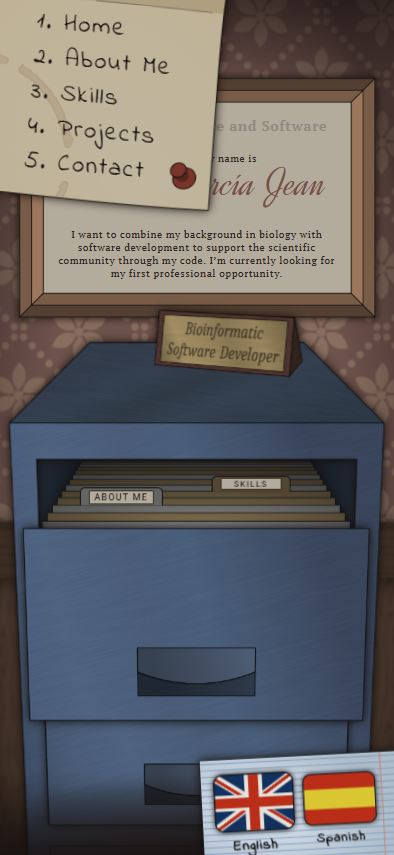
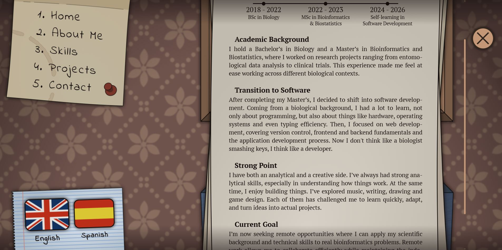

<h1>
  <a href="https://andrewgj1818.github.io/portfolio/en/">NO-JS PORTFOLIO</a>
</h1>

This portfolio is not only intended to showcase my most relevant projects, but also to demonstrate my ability to plan and execute a project in a way that simulates a professional environment. Additionally, it serves as a practical challenge to strengthen my skills in HTML and CSS, two fundamental technologies of web development.

Desktop Version | Mobile Version | Desktop Zoomed Version
:-: | :-: | :-:
 |  | 

## 🧩 Features

- Custom and distinctive visual design — filing cabinet simulation.
- Classic sections — Home, About Me, Skills, Projects, and Contact.
- Extensive use of animations and transitions to enhance user experience.
- Basic SEO optimization and accessibility compliance.
- Fully responsive design, adapted for all screen sizes.
- Built with HTML and CSS.

## 🚀 Technologies

- **HTML5**
- **CSS3**

## ✍ Wireframe


## 📁 Folder Structure

```
/portfolio
├── css/
│   ├── normalize.css
│   └── styles.css
├── docs/
|   ├── img/
│   │   ├── colorpalette.png
│   │   ├── screenshot_1.jpg
│   │   ├── screenshot_2.jpg
│   │   ├── screenshot_3.jpg
│   │   └── wireframe.png
│   ├── designoptions.md
│   ├── requirements.md
│   ├── roadmap.md
│   └── styleguide.md
├── en/
│   ├── Andrew_Garcia_Jean_CV_en.pdf
│   ├── copy.md
│   └── index.html
├── es/
│   ├── Andrew_Garcia_Jean_CV_es.pdf
│   ├── copy.md
│   └── index.html
├── src/
├── .gitignore
├── README.md
└── index.html
```

## 📌 Project Status

**✔️ Completed**

*Some minor Safari and Firefox issues will be addressed over time.*

## 📄 Additional Documentation

- **[Requirements Document](/docs/requirements.md):** Functional goals and specifications.
- **[Design Notes](/docs/designoptions.md):** Rationale behind interaction and layout decisions.
- **[Roadmap](/docs/roadmap.md):** Project development phases.
- **[Style Guide](/docs/styleguide.md):** Color and font design decisions.
